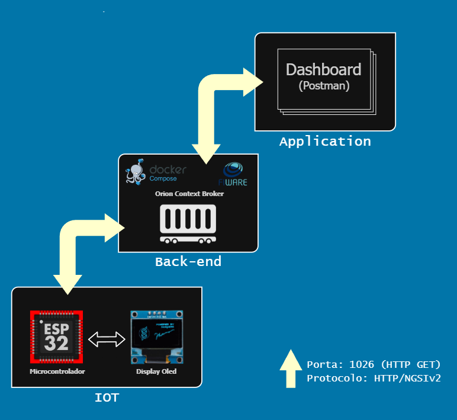

# Projeto: Brinquedo com Painel Infantil de Atendimento com ESP32-C3 e FIWARE

## 🎯 Objetivo
O projeto é composto por um brinquedo interativo impresso em 3D no formato de **gatinho**, equipado com um ESP32-C3 SuperMini e um display OLED. O brinquedo é entregue à criança junto com o responsável e exibe a senha de atendimento da criança, informando quando chegar o atendimento, tudo de forma lúdica e acolhedora.

## 🧱 Arquitetura da Solução

A solução é baseada em uma arquitetura de 3 camadas:

📡 1. IoT (Dispositivo Físico)
Brinquedo em forma de gatinho, com:

ESP32-C3

Display OLED

Realiza requisição HTTP GET para o Orion Context Broker a cada 20 segundos.

Atualiza o texto exibido conforme o valor do atributo text da entidade Display001.

☁️ 2. Back-End (FIWARE)
Orion Context Broker, hospedado em uma VM no Azure.

Porta: 1026

Armazena e disponibiliza a entidade Display001 com o atributo text, do tipo String.

Interface REST API via NGSIv2.

💻 3. Aplicação 
Painel web ou aplicação de gestão que envia atualizações para o Context Broker(Postman por enquanto).

Comunicação via HTTP na porta 1026 com cabeçalhos Fiware-Service e Fiware-ServicePath.

## 🗺️ Diagrama da Arquitetura

## 🧪 Link para a Simulação no Wokwi

[https://wokwi.com/projects/428687533684130817]

